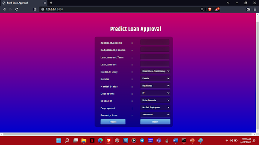

# Academic-Project--Bank-Loan-Approval---Stacking
This project aims at creating a machine learning model that could predict whether a person is eligible of obtaining a personal loan or not.
The obtained model is then deployed as a web application using Fast - API.

